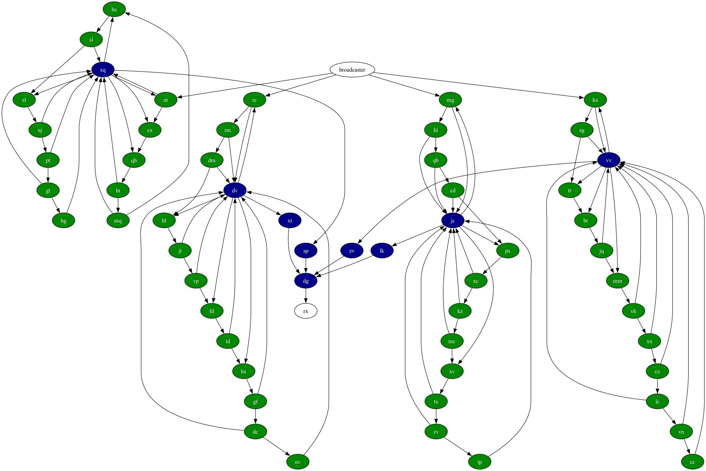
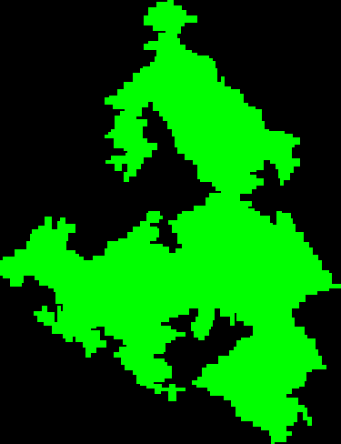
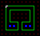
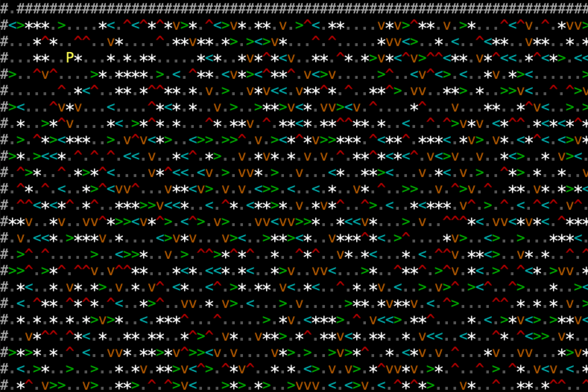
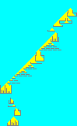
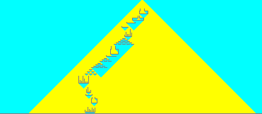
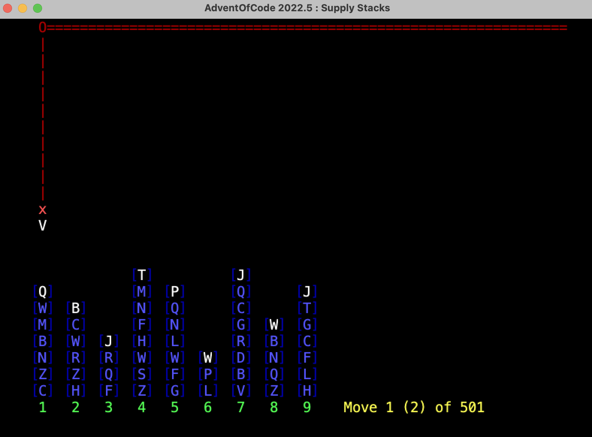

# Advent of Code

[Advent of Code](https://adventofcode.com/) is an annual programming competition, with initially simple puzzles starting
on 1 Dec, and getting progressively harder - I rarely finish the last few days.

2022 wasn't too shabby though.

```
                1111111111222222
       1234567890123456789012345
2019 : ✓✓✓✓                     
2020 : ✓✓✓✓✓✓✓✓✓✓✓✓✓.                    
2021 : ✓✓✓✓✓✓✓✓✓✓✓✓✓✓✓✓✓✓ ✓✓   .
2022 : ✓✓✓✓✓✓✓✓✓✓✓✓✓✓ .✓.✓✓✓.✓✓.
2023 : ✓✓✓✓✓✓✓✓✓✓✓✓✓✓✓✓ ...
       1234567890123456789012345
                1111111111222222
```

## 2023

## Day 20: Pulse Propagation

Nice ! A set of modules that receive input signals, modify them and send them on, into a network. I initially got
bogged down in worries about timings before eventually re-reading the question very carefully, rebuilding it all
and then it worked nicely.

Well, part 1 did. I have no idea on how to do part 2.



## Day 19: Aplenty

A decision tree : a list of workflows, involving rules and criteria pointing you to different workflows.  
Part 1 was easy.  
Part 2 mentions a number `167409079868000` which just screams "brute force will not work !". I think I have a plan in
mind : I'm building up a graph of routes through the rules; each node has ranges of values for x,m,a,s, and each time
I arrive at a node, I need to subdivide those ranges among the possible destinations. But this is complicated and I'm
tired.

## Day 18: Lavaduct Lagoon

Part 1 reasonable enough, another grid problem and follow instructions to carve out a tunnel; then flood-fill it to
work out how much space is enclosed. Curiously the instructions include wall colors, which I implemented fearing it
would be needed later - but wasn't.



Part 2 extends the grid to 14,207,222 x 20,211,216 and I am at a loss to work out how to even start this without running
out of memory.

## Day 17: Clumsy Crucible

Defeated completely. Superficially it's a route-finding algorithm, but it's a minimal cost from start to end _while
never taking more than 3 steps in one direction_ (and also only turning, never backtracking : I don't think this is an
issue though.)

No idea how to tackle it.

## Day 16: The Floor Will Be Lava

Heaps of fun, a grid with mirrors and splitters directing light beams. There is a trick to it, which I eventually
tumbled to after reading the reddit : the beams split infinitely, _but you don't need to worry about tracing an infinite
number of beams_ : as soon as you hit a tile that you have energised before, going in the same direction as last time,
you can stop that beam. Part 2 trivial.

## Day 15: Lens Library

Easy enough : ascii, hashcodes, and parsing strings & managing lists. And selling a truck.

## Day 14: Parabolic Reflector Dish

Sliding rocks on a grid. Was at an AWS thing for the first part so delayed start, then got stuck with logic until
I simplified it ;-) Then part 2 took nearly 24 hours : I almost had it right several times, but each time I fixed it
I broke something else, until I could get to the gym and plan it out in my head.

### Day 13: Point of Incidence

Ok, an easy one to help me get over yesterday. Looking for lines of reflection in a grid. Curiously part 2 didn't add
that much more processing time : a more complex algorithm, sure, but still brute-forcey, and just 63ms vs 21ms for
part 1.

¯\\_(ツ)_/¯

### Day 12: Hot Springs

First part 2 failure of this year. Given a string with various symbols and different replacement options, how many
groups can you make (paraphrased.) Part 1 was fun, part 2 increased the size by a factor of 5 and just takes too long.

I have explored some ideas about recursing into it and abandoning branches that are never going to work, but it still
takes far too long.

Update several days later : I ended up adapting [this solution](https://www.youtube.com/watch?v=NmxHw_bHhGM) by
a young Canadian called HyperNeutrino : it's the best explained version I found on Reddit. What is really interesting
is how much extra work I had to do with Java and string manipulation that just works in Python.

### Day 11: Cosmic Expansion

Not sure if I love or hate this one <grin> Ostensibly it's a map, with the sum of shortest distances; the first wrinkle
is that certain rows and/or columns are twice as wide/deep as others - yeah, I can manage this in memory - then part 2
means they are 1,000,000 times as wide/deep as others. Madness. Took about 90 minutes, answers < 200ms.

### Day 10: Pipe Maze

Loved it ! And made up for the easy yesterday. A maze / topology problem with a couple of really nice twists : a
continuous pipe winds around, eventually meeting itself. Given a starting point, (i) what's the furthest point and (ii)
how much space is ENCLOSED by the pipe. The two twists are (a) a lot of junk pipes, which look as though they should
connect, but don't; and (b) the pipes run side by side, meaning you can't use simple ray-casting or flood-fill
algorithms to solve for point-in-polygon.

So this is one of the samples : blue is space enclosed, red is space NOT enclosed, which includes the central area.
White is the start point



And this is the beast.


### Day 9: Mirage Maintenance

Curiously easy ? Lists of sequences, for each figure out the next item. The worked examples made it very clear how to
do it, and even the "Surely it's safe ..." warning about how to handle part 2 ... turned out to be safe.

¯\\_(ツ)_/¯

### Day 8: Haunted Wasteland

I've seen this before ... basically you hop about through a map until you find an end; the first part is trivial,
the second part is having to do six at once, and all 6 must hit the end at the same time. Can't do it brute force,
but if you look for patterns, each one of the six is repeating a cycle; and we then just need to find the least
common multiple.

### Day 7: Camel Cards

Another nice example, where the first part is manageable, but the second part needs a new approach. Playing poker,
work out from a list of hands what the best hand is - that's the first part, the second part then adds wild cards.

Including 5 wild cards which kind of breaks the brute force approach unless you're expecting it. 30 seconds.

### Day 6: Wait for it

Phew, a slightly more sensible one. Optimization : given a distance to travel, how do you optimize spending time
at the start to get going fast vs getting going quickly ? First part easy to iterate over every step , second part
too big but easy to convert to maths.

### Day 5: If You Give A Seed A Fertilizer

I read part 1 and thought : uh-oh. And I was right. Basically a set of ranges, and you traverse through them, hopping
from one to another, to try and end up on the smallest end value. Which is easy when you have a few points, but not
when end up with over 4 billion numbers to check.

Luckily my mate Craig explained how he did it, and that gave me an idea.

### Day 4: Scratchcards

OK, here we go : part 1 deceptively simple, part 2 on of
those [Orb](https://en.wikipedia.org/wiki/A_Huge_Ever_Growing_Pulsating_Brain_That_Rules_from_the_Centre_of_the_Ultraworld)
-like problems which get a bit out of hand. Tribble-like, to choose another metaphor. Got stuck with concurrent
modifications on the list and it's iterator but banged out a solution just in time.

### Day 3: Gear Ratios

Still happy. Read a map and place various entities : some are single coord, some are rows of several coords
which makes it trickier. Good data structures and supporting methods, so part 2 was straight forward.
Top 3k for both parts so `<smug_mode>on</smug_mode>`

### Day 2: Cube Conundrum

Faith restored in myself. Simple string parsing, and having done this competition a few times, I know to set up
some nice sensible data structures in the first part, 'cos they'll probably be useful in part 2. Into the top 4k
globally which feels a bit better than not making the top 10k on part 2 yesterday.

### Day 1: Trebuchet ?!

Ostensibly simple, I took a couple of hours to do this because I misinterpreted part 2. Ironically, only when rewriting
it a third time - this time switching to Python - and getting the logic wrong but getting the right answer did I figure
out what the problem was.

It's to do with finding digits in a string : find the first and last and append them, so `x3jd7gshr8kg` becomes `38`.

Part two involved spelled out numbers e.g. `a3eightwox` and this is where I went wrong : I assumed that because `eight`
was
in there, I should substitute `8` and continue with `a38wox` leading to `38`; but what they meant was (easier) just find
the last written number, so the `two` should still be valid, hence `32`. :facepalm.

## 2022

### Day 25: Full of Hot Air

Hmm. Having skim-read this, it looks like just encoding numbers in base 5 with symbols. Probably more complicated
thinking than programming at this point.

Lol. Way harder. Instead of counting up powers of 5, you have to shift your counts - you can't have a count of any power
of 5 greater than 2. So if you wanted say 3 x 5^2, you actually end up having to have an extra 1 x 5^3, and then you
have to take away 5 x 5^2 to balance, ending up with 1 x 5^3 and -2 x 5^2.

I got a brute force working quite quickly, but the real sample was too large, so I had to work out how to map it
directly. Attempts to do it directly, starting from the beginning or the end, turned out too hard to figure out - so I
did it with a 'mancala' style approach, divvying it up into a normal base 5 number, and then re-distributing numbers
repeatedly : if I have say 3 of one power, add 1 to the next higher power and take 5 away from this one.

https://adventofcode.com/2022/day/25

### Day 24: Blizzard Basin

Another map : you have to get from one corner to another, avoiding storms that move across the map; you'll end up moving
in one of the 4 cardinal directions (including retracing a previous step) or even waiting. I can see the storms location
is deterministic; I don't know if I can map a graph of the storms given they keep changing.

OK, so a simple approach is to just use A* but make the map time sensitive. This works nicely for the sample; and indeed
once I'd sorted out a couple of bugs, both part 1 and 2.



https://adventofcode.com/2022/day/24

### Day 23: Unstable Diffusion

Again a map, this time with elves spread around, but wanting to move so not too close to each other. Initially I thought
this would be a cellular automaton, but it turned out to be simpler (once I read the question again)
and you just need to keep track of which elf goes where, and not move any that would collide.

https://adventofcode.com/2022/day/23

### Day 22: Monkey Map (1/2)

First part awesome : you get a map with space and walls, and a list of instructions. Following the instructions, move
through the map to find out where you end up. The second part revealed that the map was actually a cube, flattened out,
and you need to redo it, given that being on the side of a cube changes orientation of the instructions. I haven't yet
understood how the orientation works.

https://adventofcode.com/2022/day/22

### Day 21: Monkey Math

First part fun, second part annoying - 36s to hill climb a result. You have a troop of monkeys which either yell out a
number, or are listening for two other monkeys, at which point they perform some operation on those two numbers and yell
that out. The second part saw you having to decide what number a particular monkey yelled out to get a given result -
and I couldn't figure out how else to do it apart from try different numbers and see if you're getting warmer or colder.

https://adventofcode.com/2022/day/21

### Day 20: Grove Positioning System

Sequences of numbers, which define how to move them around to "decrypt" them; the trick being you need to keep track of
the original order, which has a couple of nice gotchas. Second part just made them very long.

https://adventofcode.com/2022/day/20

### Day 19: Not Enough Minerals

Super excited by this one, but haven't yet figured out how to do it. 4 different kinds of robots, each mining a
different kind of ore, and then you have recipes to use different amounts of ore to make the robot. Aim is to end with
the most of the ore (actually geodes) collected by the most complicated robot. You're given different recipes to
evaluate - but end up having to make decisions (do I use up minerals early to make more simple robots, or save them up
for the most complex ones)

Update : absolutely loved this one. Wrote it up.

https://adventofcode.com/2022/day/19

### Day 18: Boiling Boulders (1/2)

A 3d puzzle. Model cubes in 3d and for part 1, work out if any cubes are touching another; part 2 I think is to find
contiguous space between cubes.

https://adventofcode.com/2022/day/18

### Day 17: Pyroclastic Flow

Tetris ! Given a cavern with 5 suspiciously Tetris shaped rocks falling down and stacking up on each other, work out how
high the stack will be at a given time.

Part 1 : 2,022 rocks, no worries.

Part 2 : 1,000,000,000,000. Logic will take 11 years. On a hunch, I thought we might get a repeating sequence - and we
do, so it's a matter of finding it and then using it.

https://adventofcode.com/2022/day/17

### Day 16: Proboscidea Volcanium (1/2)

Loved it. Super challenging - build a graph of rooms, some of which have useful valves in, then work out how to travel
around those rooms in limited time, turning certain valves on to maximise the pressure. So I needed to (a) parse the
input and build the graph (b) use A* to build up a map of distances, and then (c) create an array of states - at this
point I have visited these rooms and turned these valves on a these times, and use a BFS to figure out the best route.

Part 1 done. Part 2 changes it so it's you and an elephant (!) both walking around and turning valves on. I think I can
extend my approach - but reading the subreddit, part 2 seems to take a lot longer.

https://adventofcode.com/2022/day/16

### Day 15: Beacon Exclusion Zone (0/2)

Driving me up the wall : not complete yet. Given an array of sensors, each of which can pick up the closet beacon, use
the overlapping areas to figure out where a missing beacon CAN'T be. Currently got example working, but not part 1.

https://adventofcode.com/2022/day/15

### Day 14: Regolith Reservoir

Much easier and nice to do. Drip sand onto a pile of rocks, figuring out which way it goes, until it fills up.





https://adventofcode.com/2022/day/14

### Day 13: Distress Signal

Frustrating. Given some arrays of arrays (recursive) figure out if they are equal.

```
[1,1,3,1,1]
[1,1,5,1,1]

[[1],[2,3,4]]
[[1],4]
```

Got there eventually.

- Read the damn question carefully. Now read it again.
- Realize that they are JSON lists, so you don't actually need to write your own parser.
- Learn how Comparators work, and how you deal with lists that don't ever have equal items.

https://adventofcode.com/2022/day/13

### Day 12: Hill Climbing Algorithm

Nice. As it says, a hill climbing algorithm. You need to construct a 3d model, and then navigate to the top under
certain rules. I used A* and it worked just fine. Did see a lovely example on Reddit using Minecraft, though.

https://adventofcode.com/2022/day/12

### Day 11: Monkey in the Middle

Awesome. First part is reasonably straight forward, just detailed - you need to script some monkeys handling items and
changing them before passing them around. Second part gets challenging, with very large numbers - bigger than longs.
However, the question gives you an insight into how you can manage this.

https://adventofcode.com/2022/day/11

### Day 10: Cathode Ray Tube

Awesome. And sneaky. Again. Build a tiny little two instruction computer that parses input ready for setting a register.
And then use that to display an image on a CRT - the CRT is scanning through pixels linearly, and if the register at the
same time has a value that overlaps the current pixel, it's drawn on.

https://adventofcode.com/2022/day/10

### Day 9: Rope Bridge

Awesome. And sneaky. Given two points (head and tail of a rope), set up a system where if the head moves, the tail has
to follow it within certain constraints. Ok, not bad. Then have ten knots on the rope, not just the 2 of head and tail.
Refactor. Still works. Phew.

https://adventofcode.com/2022/day/9

### Day 8: Treetop Tree House

Nice. Given a grid of tree heights, work out first how many trees are visible from any edge (a tree must be taller than
all the trees between it and the edge) and then how big an area you can see around it. Cross
reference [day 8](https://adventofcode.com/2021/day/9) last year,

https://adventofcode.com/2022/day/8

### Day 7: No Space Left On Device

Awesome. Given some terminal output, where the user has moved around directories and listed their contents, recreate the
disk structure and calculate the size of each directory. Tree searching and recursion.

https://adventofcode.com/2022/day/7

### Day 6: Tuning Trouble

Given a long string of random characters, find the first sequence of length 4 (part 1) and 14 (part 2) where all the
characters are different.

https://adventofcode.com/2022/day/6

### Day 5: Supply Stacks

The first fun one this year; build up a series of stacks of crates, and then move crates from one stack to another
following a script provided. Part 1 moved one crate at a time, part 2 moved 3 at a time (preserving the order, so not
the same as moving 1, three times.)



https://adventofcode.com/2022/day/5

### Day 4: Camp Cleanup

Given a list of ranges (pairs of numbers), figure out which overlap.

https://adventofcode.com/2022/day/4

### Day 3: Rucksack Reorganization

Look through strings of random characters, finding characters that appear in both halves of the string.

https://adventofcode.com/2022/day/3

### Day 2: Rock Paper Scissors

Simulate a game of Rock Paper Scissors, and then read a script to play the game in a certain way.

https://adventofcode.com/2022/day/2

### Day 1: Calorie Counting

Look through a list of numbers broken up into groups, build up totals per group, and pick (part 1) the biggest group (
part 2) the top 3 groups.

https://adventofcode.com/2022/day/1

## 2021

### Day 25: Sea Cucumber

A map with the sea-floor covered in sea cucumbers; at each tick, they either move right or down, scrolling around the
map, but won't move onto another ... how many ticks until they get gridlocked ?

https://adventofcode.com/2022/day/25

### Day 21: Dirac Dice

Yes, a big numbers one. Part 1 is a simple little game about two players rolling dice and moving around a circular
track. Part 2 gets cool, and each time you throw the dice, the universe splits into 3, 3 different rolls, and 3
different states of the game ... 3, 9, 27, 81 ... final answer 433315766324816.

https://adventofcode.com/2022/day/21

### Day 20: Trench Map

Two bitmaps, one an algorithm to 'enhance the image' found on the other. Looks straight forward enough, can't remember
if there was a catch.

https://adventofcode.com/2022/day/20

### Day 18: Snailfish

Long strings of multiple-nested brackets with numbers, expand and add items with in it. Complicated.

https://adventofcode.com/2022/day/18

### Day 17: Trick Shot

In 2 dimensions simulate firing shells that arc up and are then pulled down by gravity, see if they hit a target area.
From memory this was disappointingly easy, but I did write a lot of similar stuff for fun years ago.

https://adventofcode.com/2022/day/17

### Day 16: Packet Decoder

String manipulation / decryption. Straight forward and fun.

https://adventofcode.com/2022/day/16

### Day 15: Chiton

Two dimensional topographic map, route find through it to have the lowest total height. A*, though my comments suggest
I was less than confident about it's implementation.

https://adventofcode.com/2022/day/15

### Day 14: Extended Polymerization

String manipulation : parse a string to decode rules which in turn tells you how to update the string.

https://adventofcode.com/2022/day/14

### Day 13: Transparent Origami

This was fun. A big 2d bitmap with some points marked with symbols; fold it repeatedly so the symbols start overlapping,
and when you're done you can visually see a sequence of letters.

https://adventofcode.com/2022/day/13

### Day 12: Passage Pathing

Fun; build a graph and then count the number of unique ways you can travel through it from one end to another.

https://adventofcode.com/2022/day/12

### Day 11: Dumbo Octopus

Fun; a 2d map of octopi, when one flashes, it encourages the other to flash; eventually all are flashing together.
Solved with a cellular automaton.

https://adventofcode.com/2022/day/11

### Day 10: Syntax Scoring

Parsing lots of brackets to figure out if it's valid.

https://adventofcode.com/2021/day/10

### Day 9: Smoke Basin

A map of heights - cross reference https://adventofcode.com/2022/day/8. Wrote what I think is a flood-fill to solve part
2, and it worked first time ! Though I have recreated the code in 2022, can't find the class I used in 2021.

https://adventofcode.com/2021/day/9

### Day 8: Seven Segment Search

Fun - based around 7 segment displays with mixed up wiring, analyse input and output to figure out the wiring. Had to
use some frequency analysis as part of the solution.

https://adventofcode.com/2021/day/8

### Day 7: The Treachery of Whales

Cute : align a group of crabs in a vertical line by minimizing their horizontal moves, using two algorithms.

https://adventofcode.com/2021/day/7

### Day 6: Lanternfish

A population of fish that are breeding at various intervals. Not unlike Wa-Tor.

https://adventofcode.com/2021/day/6

### Day 5: Hydrothermal Venture

Analyse a range of vectors to build lines, and then work out where the lines intersect.

https://adventofcode.com/2021/day/5

### Day 4: Giant Squid

Simulate bingo games, given a stream of numbers work out when certain boards will win

https://adventofcode.com/2021/day/4

### Day 3: Binary Diagnostic

Read some binary numbers and manipulate them

https://adventofcode.com/2021/day/3

### Day 2: Dive!

Follow a list of instructions to move forward / down / at an angle.

https://adventofcode.com/2021/day/2

### Day 1: Sonar Sweep

Find number of increases in a list; and then staggered over 3.

https://adventofcode.com/2021/day/1

## 2020

## Day 14: Docking Data

Build a binary processor that works with values and applies masks.

https://adventofcode.com/2020/day/14

## Day 13: Shuttle Search

Periods and cycles. Part 1 straight forward, part 2 needs a clever solution. The subreddit suggested Chinese Remainder
Theorem, but my maths isn't up to it. However, other examples suggested periodicity, and I translated an algorithm which
then made sense.

https://adventofcode.com/2020/day/13

## Day 12: Rain Risk

Straightforward example of moving a ship around following directions, first absolutely, and then in relation to a
waypoint that also moves.

https://adventofcode.com/2020/day/12

### Day 11: Seating System

A nice little cellular automata. Seats on the ferry fill up or empty depending on
(part 1) who is sitting next to you or (part 2) who you can see. Wrote a couple of versions of Life recently so nice and
quick.

https://adventofcode.com/2020/day/11

### Day 10: Adapter Array

Give a list of adapters, that can connect to certain other adapters, how many ways can I get through the adapters to the
end. A really challenging one in that a simple recursive solution worked fine for the small dataset, but the big dataset
had 97 adapters, which gave over 3 trillion solutions and recursion died. So I borrowed a Dynamic Programming /
Memoisation idea from the subreddit and it worked fine. The subreddit had many solutions, some of which make no sense.

https://adventofcode.com/2020/day/10

### Day 9: Encoding Error

Given a stream of numbers, find the first one that isn't the sum of a pair within the previous 25; then the sum of some
other numbers determined by that value. Straightforward.

https://adventofcode.com/2020/day/9

### Day 8: Handheld Halting

Build a little 3 instruction processor, debug a program to find the infinite loop and then figure out which instruction
is wrong to allow it to terminate. Nice.

https://adventofcode.com/2020/day/8

### Day 7: Handy Haversacks

Recursive objects, bags holding bags. Nice.

https://adventofcode.com/2020/day/7

### Day 6: Custom Customs

Set manipulation. Disappointingly easy.

https://adventofcode.com/2020/day/6

### Day 5: Binary Boarding

You're given a string of chars that identifies a specific seat on a plan using binary space partitioning; decode each
string e.g. FBFBBFFRLR to work out which row and column you are in. Then from the list, find the missing entry.

https://adventofcode.com/2020/day/5

### Day 4: Passport Processing

Parse a list of strings which have key-value pairs to make up
'passports' and find out with validation rules which are valid or not. e.g.

```'''  
ecl:gry pid:860033327 eyr:2020 hcl:#fffffd
byr:1937 iyr:2017 cid:147 hgt:183cm
```

https://adventofcode.com/2020/day/4

## Day 3: Toboggan Trajectory

Definitely cute : a map of a hillside with trees, given a certain angle to ride the toboggan down, how many trees do you
hit ? The trees repeat in patterns out to the right.

```
O.##.......
#.O.#...#..
.#..X.#..#.
..#.#.O.#.#
.#...##.O#.
```

https://adventofcode.com/2020/day/3

### Day 2: Password Philosophy

Parse strings to find out which follow specified rules.

https://adventofcode.com/2020/day/2

### Day 1: Report Repair

A list of 200 numbers, first part is to find a combination of 2 that adds up to 2020 and then multiply them together;
second part was same thing but for 3 numbers.

https://adventofcode.com/2020/day/1

## 2019

### Day 6: Universal Orbit Map

Neat. Building graphs from orbit data. I borrow GraphViz as usual to dump out the output into images so I can see what
is going on. The first part is a huge graph, but not particularly complex to build, though you do have to calculate
direct and indirect orbits; the second required Djikstra to find shortest path.

https://adventofcode.com/2019/day/6

### Day 5: Sunny with a Chance of Asteroids

More IntCode computer stuff.

https://adventofcode.com/2019/day/5

### Day 4: Secure Container

Password combinations.

https://adventofcode.com/2019/day/4

### Day 3: Crossed Wires

Calculation of distances on a grid with wires. Rather neat.

https://adventofcode.com/2019/day/3

### Day 2: 1202 Program Alarm

IntCode computer : a list of instructions and they control how to jump back and forth. Will come back again later.

https://adventofcode.com/2019/day/2

### Day 1: The Tyranny of the Rocket Equation

Repeated additions - to carry more cargo, a rocket needs more fuel, but that fuel weighs something, so that needs more
fuel ...

https://adventofcode.com/2019/day/1
