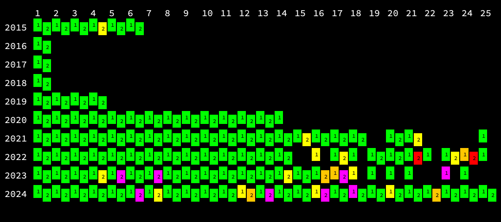

# Advent of Code

[Advent of Code](https://adventofcode.com/) is an annual programming competition, with initially simple puzzles starting
on 1 Dec, and getting progressively harder - I rarely finish the last few days. I started in 2019, and have been picking
up more and more each year (plus going back and looking at old ones.)

I've also been loudly praising it at work, with a
private leaderboard ... which got nicely
competitive, and 2024 is looking pretty good.

Performance is generally good : green is <= 1s, yellow <= 5s, orange <= 10s, red <= 30s and purple needs another look.
Plenty of days when I was so happy just to get the damn thing working, it wasn't worth optimizing.

[2024](readme_2024.md)
[2023](readme_2023.md)
[2022](readme_2022.md)
[2021](readme_2021.md)
[2020](readme_2020.md)
[2019](readme_2019.md)
[2018](readme_2018.md)
[2017](readme_2017.md)
[2016](readme_2016.md)
[2015](readme_2015.md)