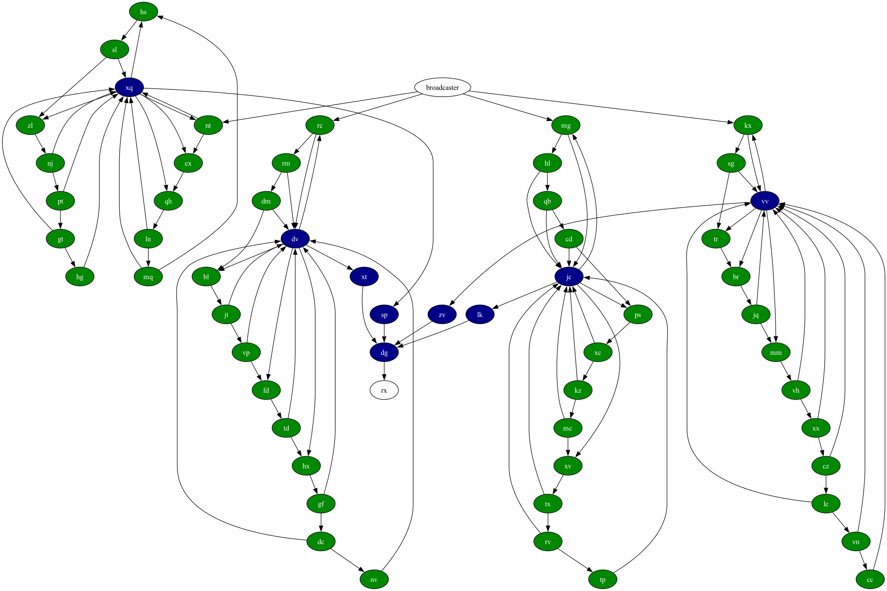

# Advent of Code 2023

## 2023

### Day 25: Snowverload. (0/2)

Lovely challenge. I can dump a graph into GraphViz and _almost_ see the solution - I can see 3 edges that link the two
clusters, just can't read their nodes - but can't figure out how to do it. I have a fast solution for the sample. For
part 1, of course. Part 2 is going to take a further 27330.794 seconds ...

https://adventofcode.com/2023/day/25

### Day 24: Never Tell Me The Odds

Part 1 was nice enough : hailstones flying around in 3 dimensions, will a given pair collide within a given volume ?
To make it manageable, part 1 was only in 2 dimensions, so was about figuring out and solving pairs of linear equations.

Part 2 introduces the 3rd dimension, and for the hell of it, adds a 4th dimension, time. Given all these hailstones,
where do you have to start throwing a rock, and in which 3d dimension, to hit all of them ? Probably math.

https://adventofcode.com/2023/day/24

### Day 23: A long walk. (1/2)

Route finding, A*, priority queue, yeah, yeah, done this before ... wait, you want the _longest_ distance ?

Turns out to be one of the best bits of logic / coding I think I've ever done. Use DFS to split the map into a graph
of nodes and edges, where the nodes are intersections. Then use A* to find the shortest path between each pair of
nodes - only some are valid, given slopes. Then finally use that to build a new graph and use DFS to find all the
(valid) routes between the start, intersections and nodes.

This was very important - mapping out by hand in Sheets where the sub-routes could go.

I might just leave part 2 for another day.

https://adventofcode.com/2023/day/23

### Day 22: Sand Slabs

Very nice. 3d Tetris / Jenga : a few shapes, made up of cubes, floating in positive integer space, let them all fall and
then count the ones you can remove without affecting anything else. Hopefully someone has done this in Minecraft.

The second part is going to be some kind of recursive trick : if I disintegrate A, which causes B and C to fall, what
then also falls ? As long as you (spoilers) keep track of which ones have been removed, it's easy. Just takes about
4 minutes.

https://adventofcode.com/2023/day/22

### Day 21: Step Counter (1/2)

Nice ! Immediately thought this looks like a cellular automaton, and indeed Part 1 fell very nicely.

Started reading part 2 : "the inexplicably-infinite farm layout." Deep sigh. I think this should be a feature of the
fact that it's a regular layout, so I expect the CA pattern to start repeating, and I just need to find some way of
figuring out the period, and how much it is expanding by. I found with the sample (11 x 11) that it repeated every
11 (!) cycles, and that I could predict on each of those 11-step boundaries, how many "complete" - once filled, they
just oscillate between two states - subgrids (11x11) I would have and and how many plots they each would contain; but
(a) I don't know how many incomplete subgrids I have and (b) it doesn't work with the real 131x131 grid.

https://adventofcode.com/2023/day/21

### Day 20: Pulse Propagation (1/2)

Nice ! A set of modules that receive input signals, modify them and send them on, into a network. I initially got
bogged down in worries about timings before eventually re-reading the question very carefully, rebuilding it all
and then it worked nicely.

Well, part 1 did. I have no idea on how to do part 2.

https://adventofcode.com/2023/day/20

### Day 19: Aplenty (1/2)

A decision tree : a list of workflows, involving rules and criteria pointing you to different workflows.

Part 1 was easy.

Part 2 mentions a number `167409079868000` which just screams "brute force will not work !". I think I have a plan in
mind : I'm building up a graph of routes through the rules; each keypadNode has ranges of values for x,m,a,s, and each
time
I arrive at a keypadNode, I need to subdivide those ranges among the possible destinations. But this is complicated and
I'm
tired.

https://adventofcode.com/2023/day/19

### Day 18: Lavaduct Lagoon (1/2)

Part 1 reasonable enough, another grid problem and follow instructions to carve out a tunnel; then flood-fill it to
work out how much space is enclosed. Curiously the instructions include wall colors, which I implemented fearing it
would be needed later - but wasn't.

Part 2 extends the grid to 14,207,222 x 20,211,216 and I am at a loss to work out how to even start this without running
out of memory. I suspect it will be something like ray-marching, but to be continued.

https://adventofcode.com/2023/day/18

### Day 17: Clumsy Crucible

Defeated completely. Superficially it's a route-finding algorithm, but it's a minimal cost from start to end _while
never taking more than 3 steps in one direction_ (and also only turning, never backtracking : I don't think this is an
issue though.)

I've got a complex idea, which is giving me a result - the wrong one - and I eventually gave up. Read some more stuff
on reddit, adapted a new algorithm and initially it was wrong ...

... but I finally figured out it was an equals/hashcode problem !

https://adventofcode.com/2023/day/17

### Day 16: The Floor Will Be Lava

Heaps of fun, a grid with mirrors and splitters directing light beams. There is a trick to it, which I eventually
tumbled to after reading the reddit : the beams split infinitely, _but you don't need to worry about tracing an infinite
number of beams_ : as soon as you hit a tile that you have energised before, going in the same direction as last time,
you can stop that beam. Part 2 trivial.

https://adventofcode.com/2023/day/16

### Day 15: Lens Library

Easy enough : ascii, hashcodes, and parsing strings & managing lists. And selling a truck.

https://adventofcode.com/2023/day/15

### Day 14: Parabolic Reflector Dish

Sliding rocks on a grid. Was at an AWS thing for the first part so delayed start, then got stuck with logic until
I simplified it ;-) Then part 2 took nearly 24 hours : I almost had it right several times, but each time I fixed it
I broke something else, until I could get to the gym and plan it out in my head.

https://adventofcode.com/2023/day/14

#### Day 13: Point of Incidence

Ok, an easy one to help me get over yesterday. Looking for lines of reflection in a grid. Curiously part 2 didn't add
that much more processing time : a more complex algorithm, sure, but still brute-forcey, and just 63ms vs 21ms for
part 1.

¯\\_(ツ)_/¯

https://adventofcode.com/2023/day/13

### Day 12: Hot Springs

First part 2 failure of this year. Given a string with various symbols and different replacement options, how many
groups can you make (paraphrased.) Part 1 was fun, part 2 increased the size by a factor of 5 and just takes too long.

I have explored some ideas about recursing into it and abandoning branches that are never going to work, but it still
takes far too long.

Update several days later : I ended up adapting [this solution](https://www.youtube.com/watch?v=NmxHw_bHhGM) by
a young Canadian called HyperNeutrino : it's the best explained version I found on Reddit. What is really interesting
is how much extra work I had to do with Java and string manipulation that just works in Python.

https://adventofcode.com/2023/day/12

### Day 11: Cosmic Expansion

Not sure if I love or hate this one <grin> Ostensibly it's a map, with the sum of shortest distances; the first wrinkle
is that certain rows and/or columns are twice as wide/deep as others - yeah, I can manage this in memory - then part 2
means they are 1,000,000 times as wide/deep as others. Madness. Took about 90 minutes, answers < 200ms.

https://adventofcode.com/2023/day/11

### Day 10: Pipe Maze

Loved it ! And made up for the easy yesterday. A maze / topology problem with a couple of really nice twists : a
continuous pipe winds around, eventually meeting itself. Given a starting point, (i) what's the furthest point and (ii)
how much space is ENCLOSED by the pipe. The two twists are (a) a lot of junk pipes, which look as though they should
connect, but don't; and (b) the pipes run side by side, meaning you can't use simple ray-casting or flood-fill
algorithms to solve for point-in-polygon.

So this is one of the samples : blue is space enclosed, red is space NOT enclosed, which includes the central area.
White is the start point.

And this is the beast.

https://adventofcode.com/2023/day/10

### Day 9: Mirage Maintenance

Curiously easy ? Lists of sequences, for each figure out the next item. The worked examples made it very clear how to
do it, and even the "Surely it's safe ..." warning about how to handle part 2 ... turned out to be safe.

¯\\_(ツ)_/¯

https://adventofcode.com/2023/day/9

### Day 8: Haunted Wasteland

I've seen this before ... basically you hop about through a map until you find an end; the first part is trivial,
the second part is having to do six at once, and all 6 must hit the end at the same time. Can't do it brute force,
but if you look for patterns, each one of the six is repeating a cycle; and we then just need to find the least
common multiple.

https://adventofcode.com/2023/day/8

### Day 7: Camel Cards

Another nice example, where the first part is manageable, but the second part needs a new approach. Playing poker,
work out from a list of hands what the best hand is - that's the first part, the second part then adds wild cards.

Including 5 wild cards which kind of breaks the brute force approach unless you're expecting it. 30 seconds.

https://adventofcode.com/2023/day/7

### Day 6: Wait for it

Phew, a slightly more sensible one. Optimization : given a distance to travel, how do you optimize spending time
at the start to get going fast vs getting going quickly ? First part easy to iterate over every step , second part
too big but easy to convert to maths.

https://adventofcode.com/2023/day/6

### Day 5: If You Give A Seed A Fertilizer

I read part 1 and thought : uh-oh. And I was right. Basically a set of ranges, and you traverse through them, hopping
from one to another, to try and end up on the smallest end value. Which is easy when you have a few points, but not
when end up with over 4 billion numbers to check.

Luckily my mate Craig explained how he did it, and that gave me an idea.

https://adventofcode.com/2023/day/5

### Day 4: Scratchcards

OK, here we go : part 1 deceptively simple, part 2 on of
those [Orb](https://en.wikipedia.org/wiki/A_Huge_Ever_Growing_Pulsating_Brain_That_Rules_from_the_Centre_of_the_Ultraworld)
-like problems which get a bit out of hand. Tribble-like, to choose another metaphor. Got stuck with concurrent
modifications on the list and it's iterator but banged out a solution just in time.

https://adventofcode.com/2023/day/4

### Day 3: Gear Ratios

Still happy. Read a map and place various entities : some are single challengeCoord, some are rows of several coords
which makes it trickier. Good data structures and supporting methods, so part 2 was straight forward.
Top 3k for both parts so `<smug_mode>on</smug_mode>`

https://adventofcode.com/2023/day/3

### Day 2: Cube Conundrum

Faith restored in myself. Simple string parsing, and having done this competition a few times, I know to set up
some nice sensible data structures in the first part, 'cos they'll probably be useful in part 2. Into the top 4k
globally which feels a bit better than not making the top 10k on part 2 yesterday.

https://adventofcode.com/2023/day/2

### Day 1: Trebuchet ?!

Ostensibly simple, I took a couple of hours to do this because I misinterpreted part 2. Ironically, only when rewriting
it a third time - this time switching to Python - and getting the logic wrong but getting the right answer did I figure
out what the problem was.

It's to do with finding digits in a string : find the first and last and append them, so `x3jd7gshr8kg` becomes `38`.

Part two involved spelled out numbers e.g. `a3eightwox` and this is where I went wrong : I assumed that because `eight`
was
in there, I should substitute `8` and continue with `a38wox` leading to `38`; but what they meant was (easier) just find
the last written number, so the `two` should still be valid, hence `32`. :facepalm.

https://adventofcode.com/2023/day/1

