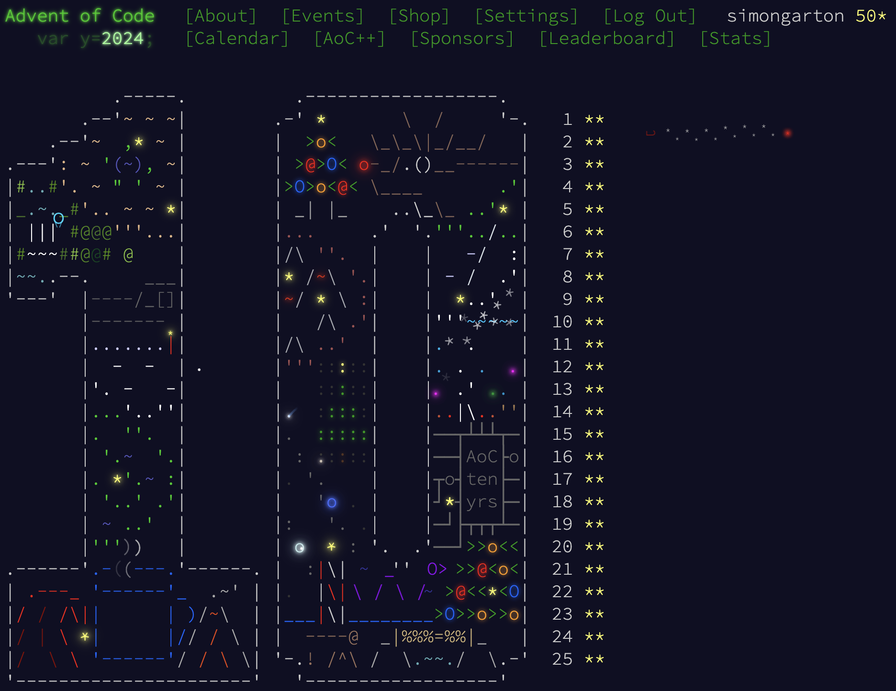
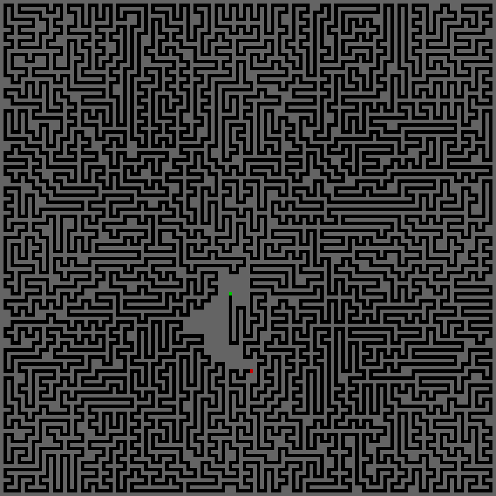
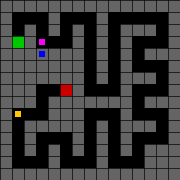
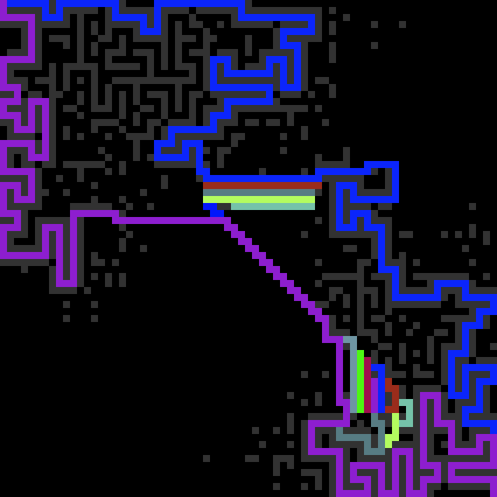
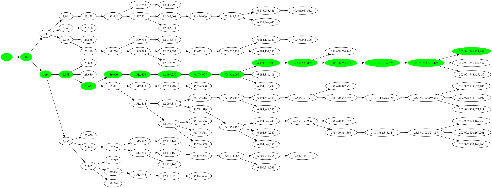
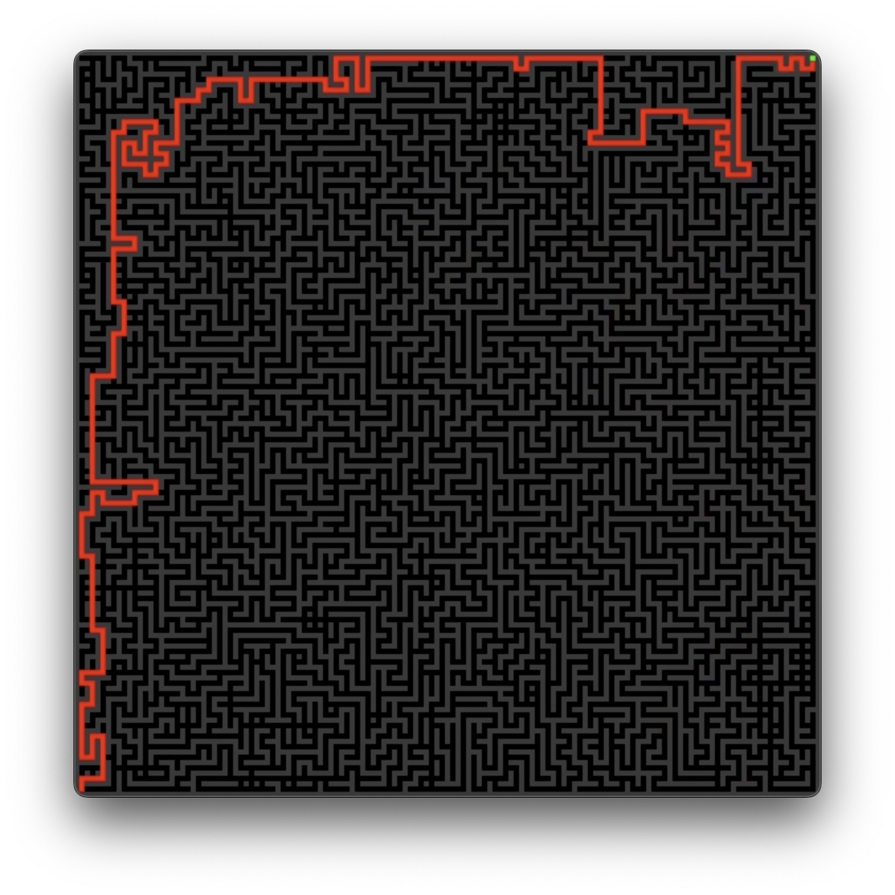
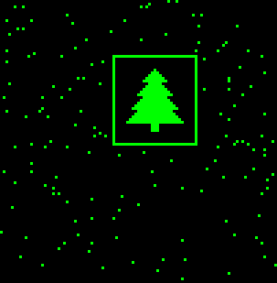
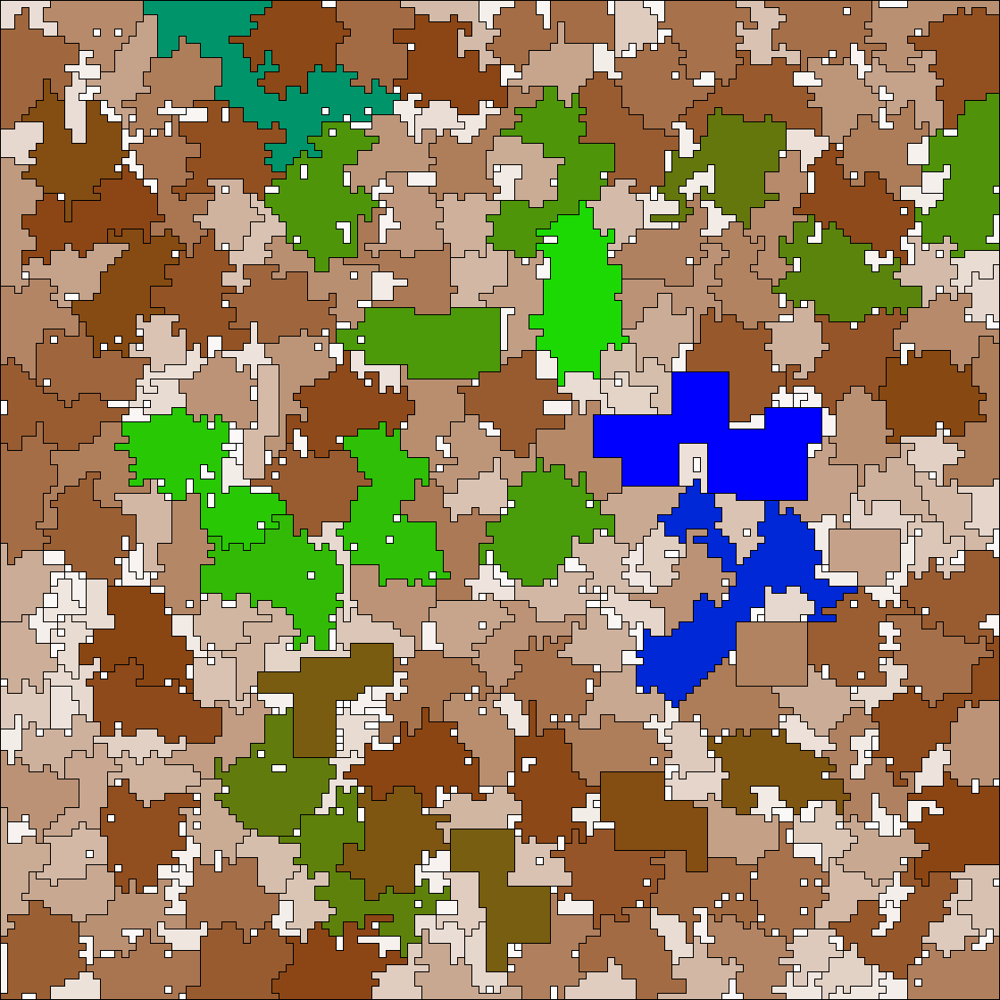

# Advent of Code 2024

## 2024

Yes, I am rather pleased with myself.



### Day 25 : Code Chronicle (1/1)

Day 25 is always easy and is always only 1 part - the second part is having 49 other stars by now, which ... I was
missing day 21 part 2, but went back and after some time, figured out what the problem was.

https://adventofcode.com/2024/day/25

### Day 24 : Crossed Wires

Very nice. Build a circuit of wires and logic gates, and analyse it. Yeah, OK. Oh, wait, 4 pairs of the gates are cross
wired - you can figure it out by looking at the inputs and outputs. Well, there's a lot of combinations to check ...


I love [GraphViz](https://graphviz.org/). Dumped it out, added some colors - and I could spot 3 of the 4 problems : the
wiring is different. But I couldn't spot the fourth ... until I looped through the 45 powers of 2 and tested if my
circuit worked adding two numbers, and it broke at a certain pair of inputs ...

https://adventofcode.com/2024/day/24

### Day 23 : LAN Party

Nice. Given a bunch of pairs - connected PCs - work out whos in a network of at least 3 ... and for part 2, work out the
largest network. I quite liked my solution for part 2 - build up alphabetical lists, for each pair, check to see if the
first is in the network, the second isn't yet ... but can join if it connects to all the others there.

https://adventofcode.com/2024/day/23

### Day 22 : Monkey Magic

Easy, probably making us feel better for the difficult ones over the weekend. Manipulating lists of numbers. My solution
takes a few seconds, so could probably be optimized, but I need to get back to days 20 and 21.

https://adventofcode.com/2024/day/22

### Day 21 : Keypad Conundrum

Brilliant. But, for a very long time, my nemesis.

Imagine a simple numerical keypad, and you have to type out a 3 digit number and press # (well, A). Only you're doing
this remotely, and so have a 4-way directional pad to move a pointer around the keypad until it's over the number you
want, when you can push it. Only you can't even do that ... there's a chain of keypads, and you need to write commands
for a directional pad to drive a second directional pad which actually operates the numerical one.

After some days of effort, I've got part 1 working very fast, 27ms. But part 2 bogs down in very deep BFS searches - and
I think the way I've done this isn't going to make speeding it up easy.

https://adventofcode.com/2024/day/21

(some weeks later) Reddit gave me the insight I needed : you _can't_ manage the strings for the key presses, and
the question clearly says it's just the shortest - so we don't need to track the strings as such, just the length.
And even though there is scary issues about going left before up or vice versa, I just explore the
entire tree - with memoization - to get the length of the shortest key-press sequence. Which was something like
169 trillion key presses, and at one press a second, it'll take me 5 million years to free the Historian.

I hope he brought snacks.

### Day 20 : Race Condition

This was fun, even though it took me ages to figure out part 2.

It's a maze with a single path through it. But for part 1, you can knock down a single wall. How many times does this
help you get to the end, quicker ? And it's a doozy of a maze - you're going from green to red.



Part 2 then became evil : you can knock up to 20 walls. Actually this is getting a bit vague, and I may have
misinterpreted the question. Does the phrase '(but can still only end when the program is on normal track)' mean that
if you're carving a shortcut, you have to stop _at the first normal track_ or can you skip over some and go into
more walls ? It's the latter.

Here's an example.



Bright green and red are the start and end; purple is the 'origin' of the shortcut, where I am on the track before I
step off into the blue portal and pop out on the yellow one (incurring travel costs, though) before
continuing on the red. This saved 60-odd picoseconds - obviously going straight down and popping out higher on that last
bit would be better.

I'm getting the first couple of counts correct (3 cheats that save 76 picoseconds, 4 for 74) but am only finding 17
cheats that saves 72 picoseconds - and there should be 22. Been staring for too long. It's also really slow, so not the
right approach.

And then I suddenly realized that most of the question is irrelevant. The cheats have to start and end on the trail, so
I don't need to worry about walls or anything - just iterate over the 3k steps in the trail twice, checking the distance
you'd save by short-cutting between two points and checking the manhattan distance. :facepalm.

(deletes many, many lines of code.)

https://adventofcode.com/2024/day/20

### Day 19 : Linen Layout

Lots of recursion and memoization. Made part 2 far too hard, went to read Reddit, realised I could chop out about 90% of
my code, move the cache to a different place, and away we go. Sometimes the numbers are so stupidly big, it becomes
obvious you're on the wrong path.

https://adventofcode.com/2024/day/19

### Day 18 : RAM Run

And I thought the Day 16 map was evil. A* delivers a shortest path very quickly, but the really shortest one
takes AGES to find.



But part 2 was disappointingly easy, just find when you've added too many walls to navigate the maze.

https://adventofcode.com/2024/day/18

### Day 17: Chronospatial Computer (1,2)

A famous OpCode computer. I've really struggled with these in the past, but this time I persevered, and got
part 1 working - I'd written the computer which reads the program, it was passing all the tests, but
failing on the real data, so I hand-coded the specific program into a 10 line Java file and spotted
a bug.

Part 2 gave me a lot of trouble. Tried brute-forcing it, obviously not going to work. Spent a lot of time staring at my
compiled version, trying to work out what would do. Then reading some [Reddit](https://www.reddit.com/r/adventofcode/)
articles, two facts slowly became obvious:

- "3 bits" and all the mod 8, % 8 made it obvious we should be working in octal numbers
- the loop in the code basically tests the last 3 bits of the a register, and shifts values on each loop, meaning I am
  working with just 16 numbers - the 16 numbers of the program, being eight opcodes and eight operands.

What I needed to do was find a number that would go through _a single iteration_ of the loop and emit the last number of
the program; then I need to multiply it by eight, and find another number that when added, would go through _two loops_
, emitting the last _two numbers_ of the program; and so on.

I got a simple version working, which produced something almost right; detailed inspection revealed it wasn't finding a
couple of numbers and was (ahem) defaulting to zero for those; I then noticed that a previous stage had more than one
option, so I need Djikstra to find all the branches.

That led on to a late night, but eventually tracked down a typo - ending a range too early - and an int/long precision
issue, and it all works beautifully. Phew.

This diagram shows the eventual path I found. I built it up left to right, but the computer will run right to left. My
actual value ended up being the green line, but you can see other paths which would have led me to other starting
numbers - looks like I have nine that would have worked - and you can also see some branches that just die.



https://adventofcode.com/2024/day/17

### Day 16: Reindeer Maze

Sometimes you just get stuck. Today was a maze-navigating algorithm, straight forward enough, except that making a turn
counts as a move, and is expensive ... meaning you have to be careful about pruning nodes. With hindsight, and looking
at my final code, it was reasonably straight forward with A* ... but I got stuck with a solution that was so almost
right ... both samples working, part 1 mapped out looks sane, animated as movies it looked sane ... but "That's not the
right answer."



Part 2 just added a level - there are multiple equivalent paths, and by default A* only gets the first. A very bright
friend really struggled with this - they've been beating me consistently all month - but because I'd spent so much time
on part 1, I must have been in the zone.

https://adventofcode.com/2024/day/16

### Day 15: Warehouse Woes

Lovely. Those dang robots again, only this time they are pushing boxes around in a warehouse ...
but if the boxes pile up against a wall, they stop.

Part 1 was straight forward. Part 2 was wonderfully devious, the boxes got twice as wide, _and so
would overlap_ if you pushed them in a certain way. Heaps of fun.

Wrote far too much code, but got the answer.

https://adventofcode.com/2024/day/15

### Day 14: Restroom Redoubt

Much nicer. A map, with robots moving around in different directions. Part 1 : at time N, count how many are in each
quadrant. Easy. Part 2 : at time X, they draw a picture of an Xmas tree : what's X ?

Wait, what ? How do I know what it should look like ? I spent some time thinking it was going to be a pointy empty
shape - a triangle - but seemed to be getting into the millions of iterations. Tried again with a solid shape, assuming
everyone would have a neighbour. Wasn't getting anywhere ... so I changed it to check to see if at least half of them
had a neigbour ... and this popped out after about seven thousand cycles (and repeatedly afterwards.)



https://adventofcode.com/2024/day/14

### Day 13: Claw Contraption

One of the deceptively simple ones, which bit hard. Given two buttons, each with a different deltaX, deltaY and a cost
try and hit a target with the number of minimum presses (and costs.)

Spent some time getting A* and Djikstra running and then realized that was total overkill.

Came up with a nice little mathematical solution : pick one button, mash it until you're about
to overshoot the prize on one axis, then back up one press at a time and hit the other button
lots of times until you overshoot again OR hit the target.

That worked fine for part1, but part2 has very big numbers. I have added a couple of optimisations
to my logic, but it's taking 10s of seconds and there are 400+. I'm also not seeing any hits yet ...
though it works for the part1 data.

I've tried some optimisations and I have smart algorithms working fine for the simple case, but overshooting -
wildly - with the big numbers. So I think I have a rounding error somewhere.

Spent far too long on it. Came back to it once all was quiet in the house ... and found not one but two places
where I was rounding numbers with 15 digits of precision :facepalm.

It now works. Oddly enough there are a couple of ones where it pauses for a good few seconds ...

```
[A: 16,70 B: 45,48] -> 10000000002546,10000000004886 failed in 33043ms
[A: 14,87 B: 67,67] -> 10000000002338,10000000004747 failed in 21540ms
[A: 19,99 B: 81,83] -> 10000000005945,10000000007921 failed in 8848ms
```

But it's time to move on.

https://adventofcode.com/2024/day/13

### Day 12: Garden Groups

Really enjoying this now. This was a 2d map of gardens identified by letters, and you have
to work out the contiguous area of each patch - including worrying about ponds inside islands
inside lakes etc. Came up with a nice little flood-fill approach ... which when tidying this up
I think it's not actually as efficient as it could be - but it worked.

Part 2 - the next 1 1/2 hours - is calculating the perimeter of the shapes BUT straight sides
are always length one. This had some nasty gotchas - inside the smallest letter C you can build
is an empty space that has 3 sides, in 3 different directions - and I had to write code
to print it out to see what was going on. 5 sample files.



https://adventofcode.com/2024/day/12

### Day 11: Plutonian pebbles

Loved it ! Take a list of numbers, and iterate with different rules : only 3 rules, but
crucially one of them will split the number into two. Which means exponential growth.

Part 1 was quick, part 2 I knew was going to be painful ... the first approach worked,
the second approach - split the original list into individual numbers and take it from there -
fell over a step later ... and that was the clue, recursion would be my friend. And of course,
having done this challenge for 6 years now, if you recurse, you're probably going to need to short
cut with memoisation. Wrote the code, ran it, and it finished instantly. Oh bugger, it crashed, I
thought. Nope, right answer in <smug_mode> 85 milliseconds </smug_mode>.

This is an example at 10 levels - part two was 75 - showing the cache hits in green.


https://adventofcode.com/2024/day/11

### Day 10: Hoof it

OK, now I'm happier again. A map and all about gradients : find paths from low to high, that are orthogonal and always
go up. Took about 1:15 for the first part and 30 seconds for the second part as I'd already got the info I wanted.

https://adventofcode.com/2024/day/10

### Day 9: Disk Fragmenter

... mutter mutter, grumble grumble ... whose idea was this, anyway ?

In reflection, a really good puzzle. With probably the most devious "omission" I have seen from an AdventOfCode :
the examples carefully dealt with ids going no further than 9, packing them into a string, where the ID takes up
one character. So what happens when you get 10 ?

First attempt worked fine (hah !) on the small and big samples, but fell over with a nasty range check error on
the real data. Looking at it, I did notice that I had overlaps ... I'm tracking two pointers, one moving up a string
and one moving down, and they had overlapped. Handling it explicitly gave me an answer, but it was too low.

In frustration I turned to Python which is far better for string manipulation. But same problem.

So I went and had dinner. And came back and thought ... I haven't really handled those file IDs properly. Instead
of treating it as a string, let's treat it as an array of integers. And low and behold (a) the right answer in (b)
about 25% of the code I had previously used.

Harrumph.

https://adventofcode.com/2024/day/9

### Day 8: Resonant Collinearity

A good challenge, but grumpy with myself. Again. 2024 is heading downhill at this point ... part 1 took 2:16, but part 2
only took 2 minutes. It's another map, with antennas, and you have to figure out where they interact ... I managed to
go down three different wrong paths before eventually figuring it all out, at which point part 1 was a simplified
version of part 2.

https://adventofcode.com/2024/day/8

### Day 7: Bridge Repair

A good challenge, but grumpy with myself. Take an array of numbers and some operators, and see if you can combine them
in a way to get to an answer. For part 1 I spent far too long trying to work out how to get combinations; for part 2
I merrily spent half an hour solving a slightly different (and much harder) question - but reviewing the challenge,
it did say what I should have done.

https://adventofcode.com/2024/day/7

### Day 6: Guard Gallivant

Excellent. A map with obstructions, and you have to map out where a guard walks, following certain rules. Part 2
involved placing additional obstructions to try and get him to walk in an infinite loop. I came up with a brute force
solution for this which took some minutes ... so came up with two optimisations : only put obstructions where the guard
would have walked anyway; keep track of where I have been each time _and in which direction I was going_ and if I
repeat, then I must be in an infinite loop. Now finishing in about 86 seconds.


https://adventofcode.com/2024/day/6

### Day 5: Print Queue

Excellent. A list of pairs of pages, where for A|B A must go before B in any combined list; and then a series of
combined lists, so you have to make sure all the pairs are valid. So A,B,C is valid; C,A,B is valid, but not B,A,C.

Part 2 : some of them weren't valid, but could be : sort them out. I tried brute force and ran out of memory; then I
tried building up a new list one item at a time, and that worked. My friend Rudy tried a Comparator which sounds
way more sophisticated.

https://adventofcode.com/2024/day/5

### Day 4: Ceres search

Given a grid of letters, do a word search. I started off with a nice clever algorithm using objects and recursion,
which worked perfectly with the tiny sample data, but gave me one extra for the bigger sample. After some lengthy
investigation, I worked out I was being too clever - and my words were changing direction, which wasn't allowed. Then
adding a limit to changing direction, I then realised I had no efficient way of trying to start from the same X twice.

So I threw that all away, and an hour in, started over with string manipulation. Took 30 minutes to get the first part
and a further 10 for the second part. Kicking myself.

Good puzzle, though.

https://adventofcode.com/2024/day/4

### Day 3:  Mull it over

Parse a string - no, wait, six strings (:facepalm) - looking for valid calculations inside garbage text.  
Severe bruising on leg following kicking myself for not having learned regex.  
Then got stuck on part 2 until I realised I cannot treat the strings individually. That was evil for day 3, Eric. We
were saying day 2 was disappointingly easy ...

https://adventofcode.com/2024/day/3

### Day 2:  Red-Nosed Reports

Server crashed several times while trying to get puzzle and submit answers :rofl  
Straight forward - suspicious, not sure what's going on here - parse data into lists, and look
at deltas.

https://adventofcode.com/2024/day/2

### Day 1:  Historian Hysteria.

Spent more time trying to find the IntelliJ full line completion setting to turn it off - I'd already turned off
Copilot - than I had hoped. Straight forward read two lists, sort, compare.

https://adventofcode.com/2024/day/1

