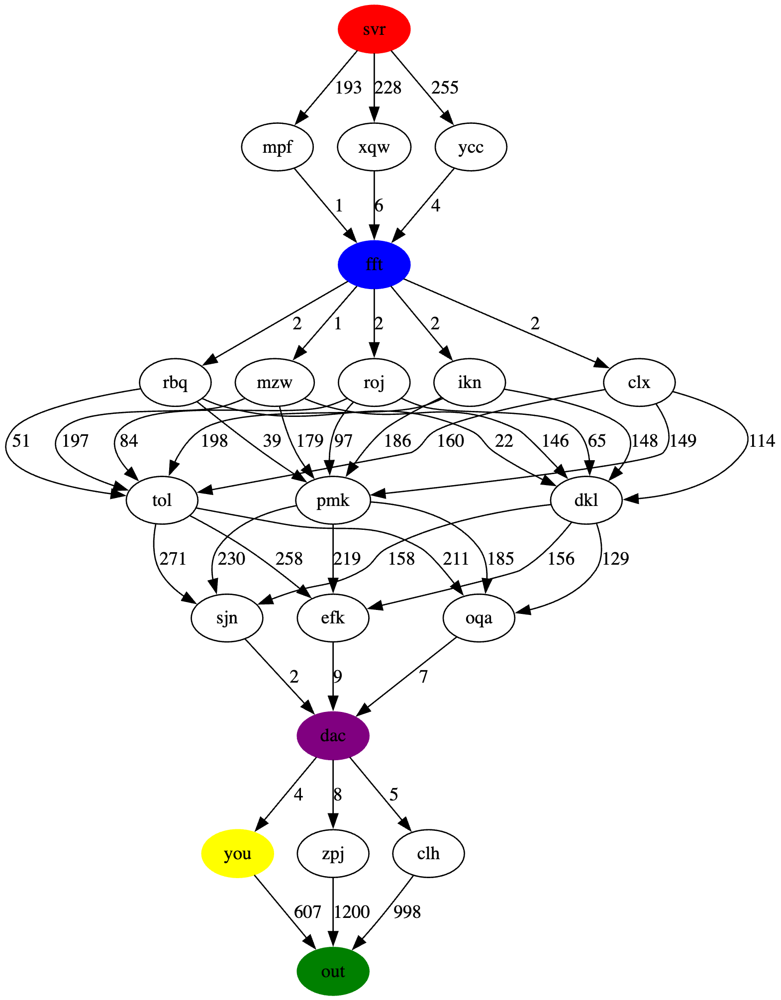
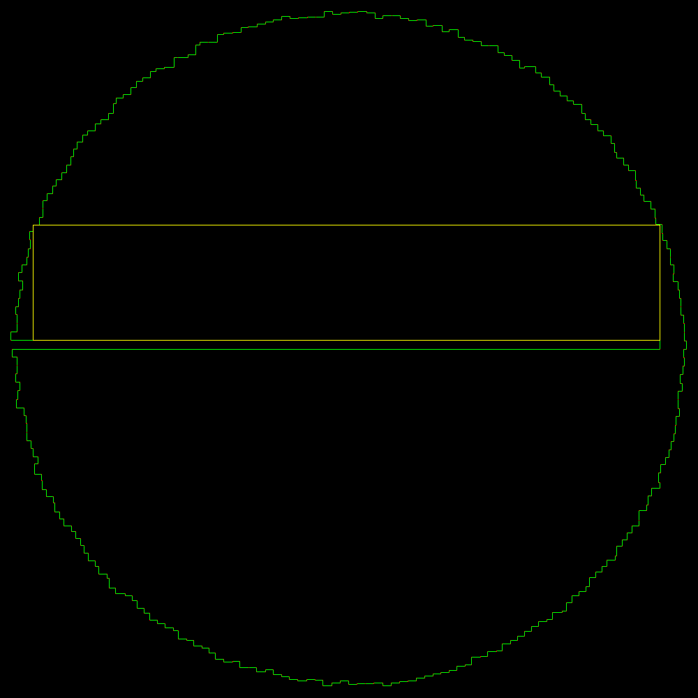
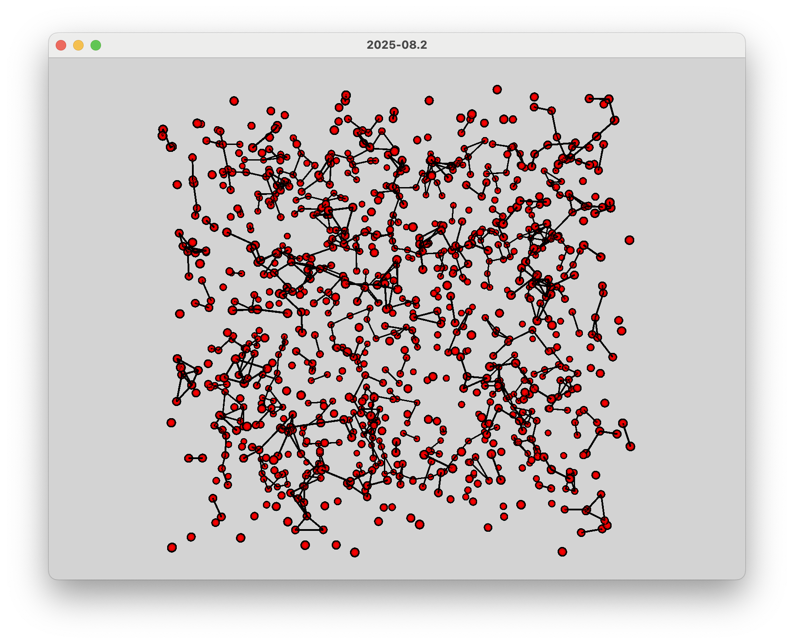
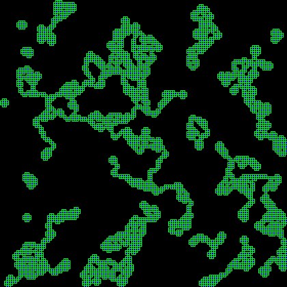

# Advent of Code 2025

### Day 9 : Movie Theater

### Day 11 : Reactor

Loved it. A big directed graph.


Part 1 is easy, just count the paths from the yellow to the green node.

Part 2 is the whole graph, but count only the paths that go through the purple and blue nodes. Eyeballing the graph,
you can clearly see a series of bottlenecks, so you can divide the problem into these important nodes, trace multiple
smaller networks to reduce them to a single path, and then multiply the costs ...



### Day 10 : Factory

Loved it and learned something new.

Build a series of machines with lights that (part 1) must be on or off and (part b) must have an input voltage.

Each machine has a series of buttons, each of which will either toggle the light on/off or add 1 to the input voltage.

What's the minimum number of button presses to get each machine into a particular state ?

Solved part 1 with a breadth-first search. Part 2 similar algorithm is working but is far too slow.

Reddit talked about a package called Z3 which _everyone_ seemed to be using. I went off and had a look at it seemed
a little baffling, but I could get a simple example to work. Converting this problem into the right code ... was
actually pretty simple, Microsoft (and others) have done it very nicely.

```python
from z3 import *

## [.##.] (3) (1,3) (2) (2,3) (0,2) (0,1) {3,5,4,7}

# I need some variables to store the 4 joltages at the end.
j0 = Int('j0')
j1 = Int('j1')
j2 = Int('j2')
j3 = Int('j43')

# how many buttons do I have to press?
b0_presses = Int('b0_presses')
b1_presses = Int('b1_presses')
b2_presses = Int('b2_presses')
b3_presses = Int('b3_presses')
b4_presses = Int('b4_presses')
b5_presses = Int('b5_presses')

total = Int("total")

o = Optimize()

# I want to solve it so that j1 is 3, etc
o.add(
    ## constraints for joltages
    b4_presses + b5_presses == 3,
    b1_presses + b5_presses == 5,
    b2_presses + b3_presses + b4_presses == 4,
    b0_presses + b1_presses + b3_presses == 7,

    # sanity - can't have negative button presses
    b0_presses >= 0,
    b1_presses >= 0,
    b2_presses >= 0,
    b3_presses >= 0,
    b4_presses >= 0,
    b5_presses >= 0,
)

# optimise
o.minimize(b0_presses + b1_presses + b2_presses + b3_presses + b4_presses + b5_presses)

if o.check() == sat:
    model = o.model()

    total = (model[b0_presses].as_long() +
             model[b1_presses].as_long() +
             model[b2_presses].as_long() +
             model[b3_presses].as_long() +
             model[b4_presses].as_long() +
             model[b5_presses].as_long())

    print("Total button presses:", total)
else:
    print("Problem is unsatisfiable")
```

The problem was that at this point I had a single file that had hardcoded values for the first line of the sample,
and there are 177 complicated lines to process. But the Z3 file - and the way I had coded it - followed a very simple
pattern ... so I wrote _another_ file that read the data line and then dynamically created - and executed a script for
each line of data.

Which worked first time, in seconds.

### Day 9 : Movie Theater



A slightly odd one. I enjoyed the first part as reading and working with the coords was fun, then the second part
was clearly going to be hard. I went and looked up algorithms on ray tracing and gone one working for the sample; but
then tried it on the second ... and it was screamingly slow.

So time to generate a map and take a look. And mine is basically a big circle - slightly uneven - with a big chunk taken
out of the middle. So that clearly means I can get rid of half of the problem immediately, any rectangle crossing the
centreline will be invalid.

But it's still going to be too slow to ray trace to make sure. So I take a look at the outside of the circle and ...
it's not indented anywhere else ... which means I probably don't have to ray trace. All I need to do is check all four
corners are inside the main polygon and give it a try.

Why I'm ... unsatisfied is that if this hadn't worked, I don't know how to do it. Seems a bit of a cheat to have just
one hole/indentation...

https://adventofcode.com/2025/day/9

### Day 8: Playground

Liked this. Basically it's a set of 3d points : join the two closest to make a line, then keep joining the next two
closest ... sometimes you'll append to an existing line, sometimes you'll bridge two lines, and eventually you end up
with a single branching network

Got some 3d graphics going ... need to work out how to color the sets and fly through the scene,



https://adventofcode.com/2025/day/8

### Day 7 : Laboratories

aka Lanternfish ! Helps if you've done older AoCs. Initially it's a simple trace rays that split at prisms, count number
of splits sort of thing ... but part 2 goes many-worlds, and the numbers get too big to track individually.

But the insight is that you can derive the number of rays in any given cell by counting the ones above, and above
left/right, depending on a couple of basic rules. And memos.

Figured it out on the bus into work, had to spend the day itching to get home.

https://adventofcode.com/2025/day/7

### Day 6 : Trash Compactor

Oh, this made me laugh. A funnily formatted worksheet, parse the strings, remove the excess spaces, and part 1 is easy.
Part 2 ... oh wait, the spaces between numbers becomes critical.

Had to write a nifty algorithm to extract the calculations from the worksheet, then it was easy.

https://adventofcode.com/2025/day/6

### Day 5 : Cafeteria

Liked this one. Ranges of numbers, do other numbers fall in those ranges ? That was easy ... so the elves want to know
how many possible ingredients could be fresh ... and the ranges overlap. Had a couple of hurdles to get through trying
to collapse identical ranges and then ranges that started OR ENDED aligned with another ... but I got there, and the
elves can relax, they have 352,509,891,817,881 fresh ingredients available.

https://adventofcode.com/2025/day/5

### Day 4 : Printing Department

Straight forward map manipulation. Second part was amusing, but not too challenging.



https://adventofcode.com/2025/day/4

### Day 3 : Lobby

Oh, this was a good one. First part didn't look too hard, second part looks baffling. I know I could solve it with
a tree and Djikstra or a BFS ... but I didn't want to remember how to. So I went and had dinner, came back and stared
at it ... and realized it was actually pretty simple, just divide and conquer. Memoisation sort of.

https://adventofcode.com/2025/day/3

### Day 2 : Gift Shop

Part 1 straight forward, part 2 ... trickier, there was a little gotcha in the logic if you weren't carefully thinking
about what the question meant.

https://adventofcode.com/2025/day/2

### Day 1 : Secret Entrance

Clock arithmetic. Did it quickly with a simple algorithm. There must be a better way.

https://adventofcode.com/2025/day/1