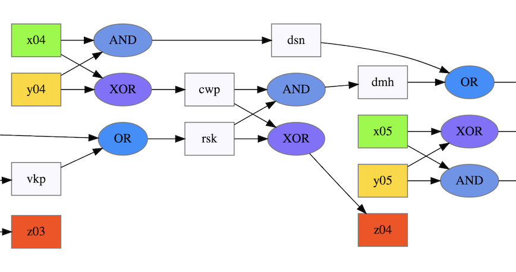
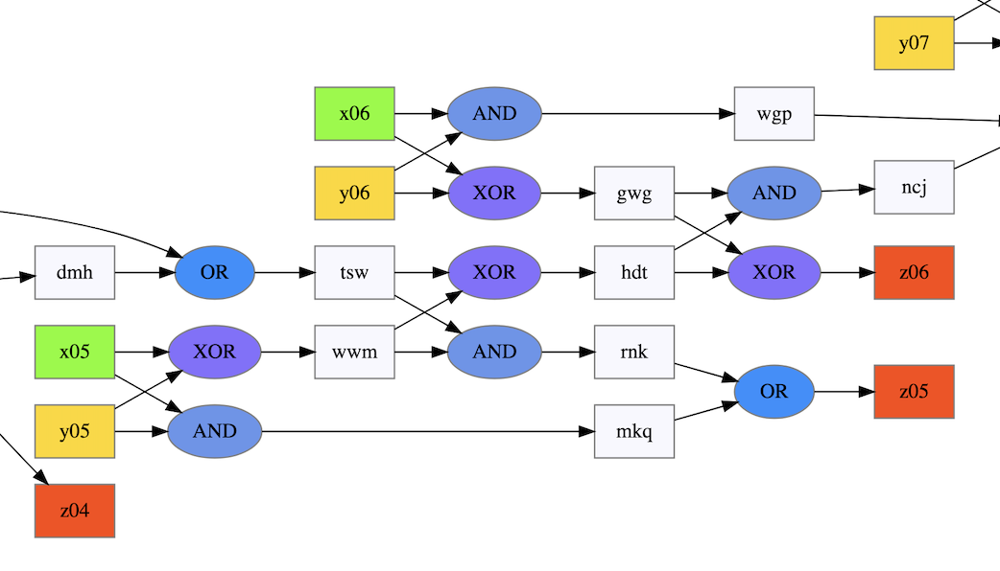
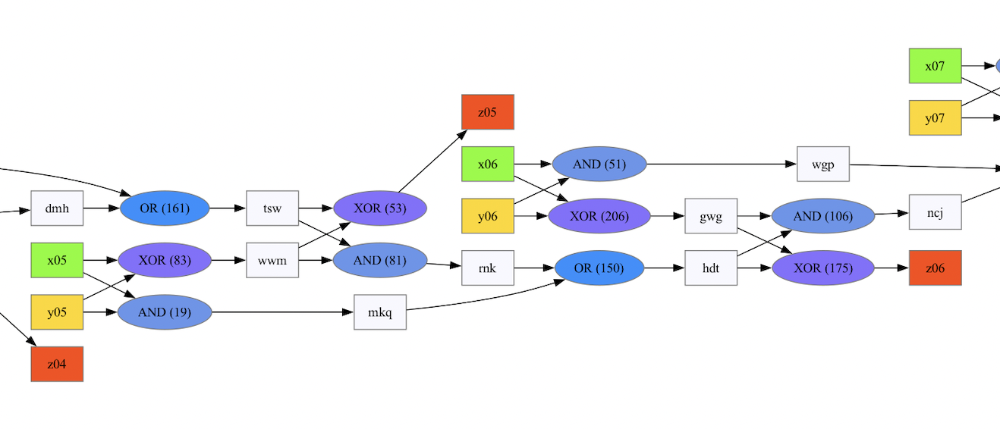
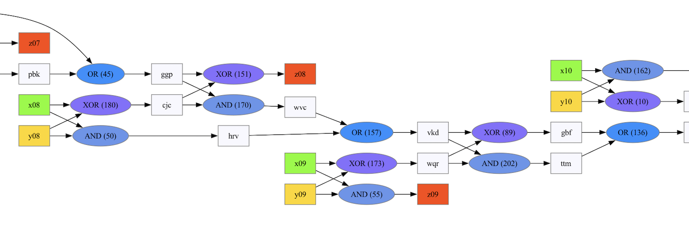
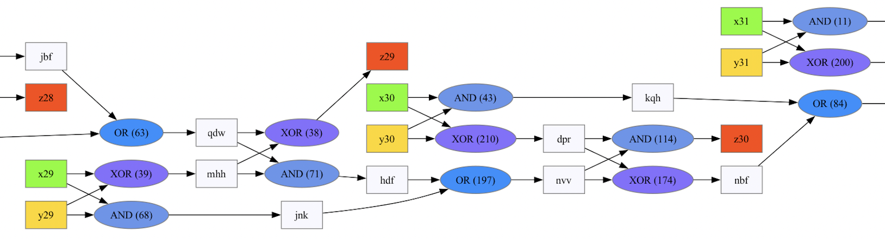

### Graphical solution

I dumped this out into graphviz to take a look.


And dumped out some stats by analysing it with code. For each gate, where does it go next ?

```
XOR->[AND,XOR]=44 : so we have 44 going to both; and there are 44 inputs

OR ->[AND,XOR]=42 : this pair looks suspicious
OR ->[]=2

AND->[OR]=85
AND->[AND,XOR]=2
AND->[]=2
XOR->[OR]=3
XOR->[]=42
```

Looking at the OR problem, I can see this pattern repeating.

- Green and Yellow inputs both go into an AND and an XOR.
- The XOR, and the OR from the previous pattern go into another AND and XOR
- That second XOR goes out to the output at Z
- That second AND meets the AND from the first pattern in an OR (which gets carried forward)



And here's where it breaks down.



So if we swap the ouputs of gates 53 and 150 ... it's fixed



Nice. Next problem ... swap 55 and 89 ?



Fix, and repeat



I've now done 3 swaps of the 4 so we're almost there.

```
        final List<OutputSwap> swapsNeeded = List.of(
                new OutputSwap(53, 150), // hdt & z05
                new OutputSwap(55, 89), // z09 & gbf
                new OutputSwap(174, 114) // nbf & z30
        );
```

```
XOR->[AND,XOR]=43
OR ->[AND,XOR]=43

XOR->[OR]=1
OR ->[]=1

XOR->[]=45
AND->[OR]=87
AND->[AND,XOR]=2
```

There are 45 inputs and 46 outputs (z) - and the last one is an OR

The differences appear to be at the start and end - which, since the sequence
extends over two cycles, is kind of inevitable.

I could .. brute force ?